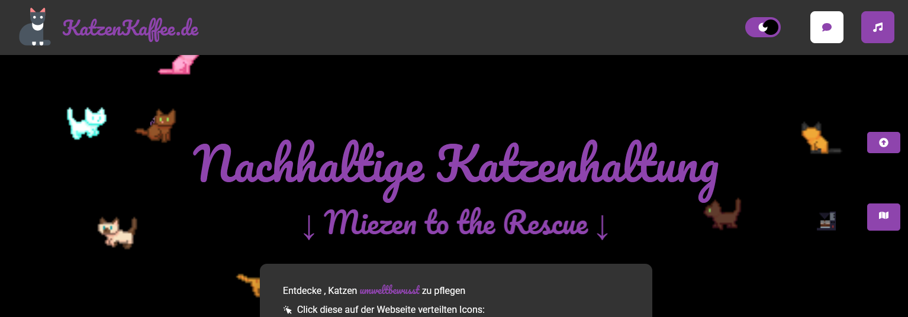
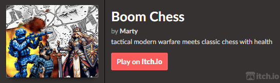
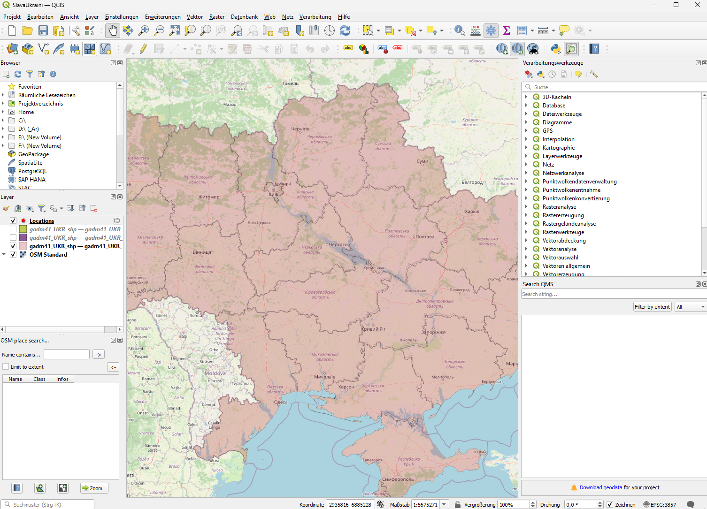
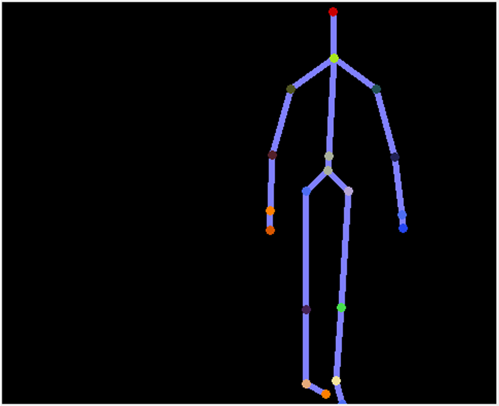
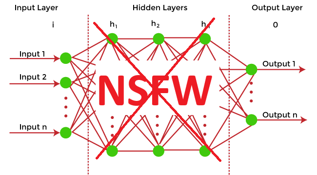
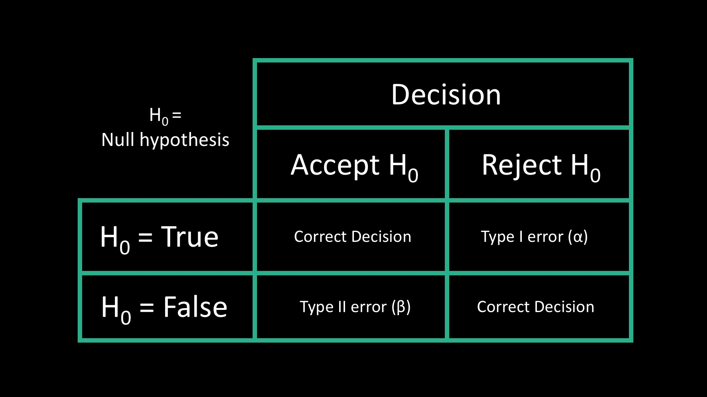

<h1>Hi 👋</h1>

  

    
In the following categories, all current and former projects are listed in respect to their finish date and, if applicable, open-source license.

     
    
If you have any project you would like to collaborate on, please send a quick message to: <strong>contactmarty.certify938@passinbox.com</strong>

  

 

    
     
    (Q1 2025)

 

    
     
    (Q1 2024)

 

<h3>Projects Chronologically</h3>

<table style="width:100%;">

<tr>
    <td style="width:50%;">
      <h3>EntropyVisualizer - Arduino-based sensor read-in to serial and LED strip</h3>
      
✅ Finished and in Production/Archive

      
🌐 AGPL-3.0 License

      
<strong>Tech:</strong> C++

      
<strong>Time:</strong> Q2 2025

      
Microcontroller board equipped with a gas meter, temperature/humidity sensor, microphone, display, and LED strip. Using sensor data to generate randomness, visualizes it with colors on the LED strip, and outputs a random long unsigned integer via its serial interface, which can be read in to try to get close to true randomness.

      
Though to the analog data (0-1023) of the microphone and the gas sensor, and the patterned fluctuations it thereby experiences, I suggest testing it out first on any new system to determine the amount of actual entropy achievable in your environment. 

      
    </td>
  <td align="center"  style="width:50%;">
      
    </td>
  </tr>

<tr>
    <td style="width:50%;">
      <h3>TelegramToMap - Automatic Threat-Location Data Mapping</h3>
      
🔄 Ongoing Development

      
🌐 AGPL-3.0 License

      
<strong>Tech:</strong> Python, QGIS

      
<strong>Time:</strong> Q2 2025

      
Scans incoming messages in Telegram groups for Ukrainian air alarms, extracting location data of UAVs, missiles, and planes. Adds a red marker to the map in QGIS, which turns white after some time and eventually disappears.

      
Created since I had a hard time keeping up with translating and typing in the translated location to unsecure map-services. This saves time and stays completly local after receiving the telegram information.

      
    </td>
  <td align="center"  style="width:50%;">
      
    </td>
  </tr>
  
<!--- MASK - Machine-Learning Assisted Skeleton Kinect Tracking -->
<tr>
    <td style="width:50%;">
      <h3>MASK - Machine-Learning Assisted Skeleton Kinect Tracking </h3>
      
 🔄 Ongoing Develoment 

      
🌐 AGPL-2.0 License

      
<strong>Tech:</strong> Python, lots of Python

      
<strong>Time:</strong> Q2Q32025 

      
Approach for threshold-based pose recognition in TouchDesigner using a KinectV2, MediaPipe, and their connection via data synchronization and a Kalman filter. The system utilizes machine learning to improve Kinect skeleton tracking and aims to enable precise pose recognition.  

      
Designed for triggering subroutines while tracking in a light-noisy environment with relatively fast-moving bodies

      
    </td>
  <td align="center"  style="width:50%;">
      
    </td>
  </tr>

<!--- Python script to recursively travers a directory structure and check all image files on likelyhood of nsfw by using machine learning -->
<tr>
    <td style="width:50%;">
      <h3> cleanSmut </h3>
      
 ✅ Finished and in Production/Archive 

      
🌐 AGPL-3.0 License

      
<strong>Tech:</strong> Python 

      
<strong>Time:</strong> Q12025 

      
Python script to recursively travers a directory structure and check all image and additionaly video files, to identify potentially NSFW content using a neural model trough a h5 file usage (the OpenNSFW2 library) , and moves flagged files to a separate folder. The script processes files in parallel for efficiency, logs NSFW probabilities, and ensures smooth operation  with built-in error handling and safety measures 

      
Designed as a tool in data recovery and long-term storage to sort out unwanted files for archiving.

      
    </td>
  <td align="center"  style="width:50%;">
      
    </td>
  </tr>

<!--- Javascript Subprocess exif data sorting scripts into media&files -->
<tr>
    <td style="width:50%;">
      <h3> Exif_DataByDate_Sorting </h3>
      
 ✅ Finished and in Production/Archive 

      
🌐 AGPL-3.0 License

      
<strong>Tech:</strong> Javascript 

      
<strong>Time:</strong> Q12025 

      
Automates the organization of files into structured directories based on their creation dates and file types. (processes files, determines their creation dates using EXIF metadata or file system dates, and moves them to appropriate year, month (, datatype) directories) 

      
Designed as a tool in data recovery and long-term storage to sort files for quick look-up and memory preservation. Uses backups and hash-checks to make sure no corruption appeared though to software layer errors.

      
    </td>
   <td align="center"  style="width:50%;">
      
    </td>
  </tr>

<!-- R Tutorial with Survey -->
  <tr>
    <td style="width:50%;">
      <h3>R Datamanipulation Tutorial</h3>
      
 ✅ Finished and in Production/Archive 

       
📜 MIT License

      
<strong>Tech:</strong> R, HTML, CSS, Markdown

      
<strong>Time:</strong> Q12025 

      
R-script that, when run, opens a localhosted browser to learn statistical approaches in data sciences through a self-collected dataset interacting with local R-tools.

      
Designed as a way to learn fundamental data science stuff more or less visually pleasing.

      
    </td>
    <td align="center"  style="width:50%;">
      
    </td>
  </tr>

<!-- Mixtape -->
  <tr>
    <td style="width:50%;">
      <h3>Mixtape</h3>
      
 ✅ Finished and in Production/Archive 

      
 🌐 AGPL-3.0 License 

      
<strong>Tech:</strong> TouchDesigner, DaVinci Resolve, Python, Arduino C++

      
<strong>Time:</strong> Q1 2025

      
270° interactive digital art project to experience a life's musical emotions through memories of birthdays.

      
    </td>
    <td align="center"  style="width:50%;">
      <a href="https://www.youtube.com/playlist?list=PLJR0d_Vv370_5z8SbQHiUYpTRRZ9-fPv3">
        )" height="150">
      </a>
    </td>
  </tr>

<!-- Modern Offroad Vehicle Infotainment System -->
  <tr>
    <td style="width:50%;">
      <h3>Modern Offroad Vehicle Infotainment System</h3>
      
 ✅ Finished and in Production/Archive 

      
📜 MIT License

      
<strong>Tech:</strong> FIGMA, HTML

      
<strong>Time:</strong> Q1 2025

      
Infotainment system design for a family outdoor car, with improved machine control and entertainment.

      
    </td>
    <td align="center"  style="width:50%;">
      
    </td>
  </tr>

<!-- KatzenKaffee -->
  <tr>
    <td style="width:50%;">
      <h3>KatzenKaffee</h3>
      
 ✅ Finished and in Production/Archive 

      
🌐 AGPL-3.0 License

      
<strong>Tech:</strong> NextJS, React, SQLite

      
<strong>Time:</strong> Q4 2024

      
Website to learn sustainable cat owning. <a href="https://katzenkaffee.vercel.app/">Visit here</a>

      
    </td>
    <td align="center"  style="width:50%;">
      
    </td>
  </tr>

<!-- HIDmibbi -->
  <tr>
    <td style="width:50%;">
      <h3>HIDmibbi</h3>
      
🟡 Finished, Standing by for Issue Creations 

      
🌐 AGPL-3.0 License

      
<strong>Tech:</strong> C++, Arduino

      
<strong>Time:</strong> Q3 2024

      
Windows 11 admin gain via cheap USB microcontrollers to visualize rubber ducky exploits by UI.

      
    </td>
    <td align="center" style="width:50%;">
      
    </td>
  </tr>

<!-- BoardGame Jam Framework (Blank) -->
  <tr>
    <td style="width:50%;">
      <h3>BoardGame Jam Framework (Blank, Free to Use!)</h3>
      
 ✅ Finished and in Production/Archive 

      
🌐 AGPL-3.0 License

      
<strong>Tech:</strong> Java

      
<strong>Time:</strong> Q3 2024

      
    </td>
    <td align="center" style="width:50%;">
      
    </td>
  </tr>

<!-- BoardGame Jam Framework (Chess) -->
  <tr>
    <td style="width:50%;">
      <h3>BoardGame Jam Framework (Chess, Free to Use!)</h3>
      
 ✅ Finished and in Production/Archive 

      
🌐 AGPL-3.0 License

      
<strong>Tech:</strong> Java

      
<strong>Time:</strong> Q3 2024

      
    </td>
    <td align="center" style="width:50%;">
      
    </td>
  </tr>

<!-- BoardGame Jam Framework (Checkers) -->
  <tr>
    <td style="width:50%;">
      <h3>BoardGame Jam Framework (Checkers, Free to Use!)</h3>
      
 ✅ Finished and in Production/Archive 

      
🌐 AGPL-3.0 License

      
<strong>Tech:</strong> Java

      
<strong>Time:</strong> Q3 2024

      
    </td>
    <td align="center" style="width:50%;">
      
    </td>
  </tr>

<!-- CSS Art Tutorial -->
  <tr>
    <td style="width:50%;">
      <h3>CSS Art Tutorial</h3>
      
 ✅ Finished and in Production/Archive 

      
🌐 AGPL-3.0 License

      
<strong>Tech:</strong> HTML, CSS

      
<strong>Time:</strong> Q3 2024

      
Quick, short, and easy tutorial on how to create dynamic animated logos with CSS.

      
    </td>
    <td align="center" style="width:50%;">
     
    </td>
  </tr>

<!-- Q1Q2 2024 Study-Projects -->
  <tr>
    <td style="width:50%;">
      <h3>Q1Q2 2024 Study-Projects</h3>
     
 ✅ Finished and in Production/Archive 

      
📜 MIT License

      
<strong>Tech:</strong> C++, C#, Java, Python

      <ul>
        <li>Levenshtein Distance Corruption-Restorer (C++)</li>
        <li>Producer-Consumer-Problem Displayer via AWT (Java)</li>
        <li>Function Graph Display (Python with Tkinter)</li>
        <li>PGM Filter Operations with Custom Canvasing Display</li>
      </ul>
      
    </td>
   <td align="center" style="width:50%;">
     
    </td>
  </tr>

<!-- Boom Chess! -->
  <tr>
    <td style="width:50%;">
      <h3>Boom Chess</h3>
      
🟡 Finished, Standing by for Issue Creations 

      
🌐 AGPL-3.0 License

      
<strong>Tech:</strong> Java, libGDX

      
<strong>Time:</strong> Q3 2023 - Q1 2024

      
Military-Pixel Pieces with Health and complex relations fight it out on the modern chess board. Features 3 different bot modes, challenge modes, multiple team colors, and music by Artist Wambutz.

      
      
    </td>
    <td align="center" style="width:50%;">
      
  </td>
  </tr>

<!-- Senet: A Simple Workers Game -->
  <tr>
    <td style="width:50%;">
      <h3>Senet: A Simple Workers Game</h3>
      
 ✅ Finished and in Production/Archive 

      
🌐 AGPL-3.0 License

      
<strong>Tech:</strong> Java, libGDX

      
<strong>Time:</strong> Q4 2023

      
The oldest known board game, re-created as a speedrun challenge with the libGDX Framework.

      
    </td>
  <td align="center" style="width:50%;">
      
  </td>
   </tr>

<!-- Tropico 6 - Advanced Teams -->
  <tr>
    <td style="width:50%;">
      <h3>Tropico 6 - Advanced Teams</h3>
      
 ✅ Finished and in Production/Archive 

      
🌍 Creative Commons Zero Universal (CC0)

      
<strong>Tech:</strong> Unreal Engine 4, C++

      
<strong>Time:</strong> Q4 2023

      
Adds team features to the multiplayer - no cooldown on team money transfer. A simple Unreal Engine 4 asset overwrite.

      
    </td>
    <td align="center" style="width:50%;">
      
  </td>
  </tr>

<!-- Space Mouse -->
  <tr>
    <td style="width:50%;">
      <h3>Space Mouse: The Special Operodent</h3>
      
 ✅ Finished and in Production/Archive 

      
🌍 Creative Commons Zero Universal (CC0)

      
<strong>Tech:</strong> Python

      
<strong>Time:</strong> Q2 2023

      
A randomly generated 3D maze-solving game with a space mouse searching for cheese.

      
    </td>
 <td align="center" style="width:50%;">
        
    </td>
   </tr>

<!-- Hangman 2 -->
  <tr>
    <td style="width:50%;">
      <h3>Hangman 2 - The Dictionaries Strike Back</h3>
      
 ✅ Finished and in Production/Archive 

      
🔓 The Unlicense

      
<strong>Tech:</strong> Python

      
<strong>Time:</strong> Q2 2023

      
A complex word-guessing game using datasets and hash maps to calculate the most likely word.

      
    </td>
    <td align="center" style="width:50%;">
      
    </td>
  </tr>

<!-- Stop the Token -->
  <tr>
    <td style="width:50%;">
      <h3>StopTheToken</h3>
      
 🔄 Ongoing Develoment 

      
🔓 The Unlicense

      
<strong>Tech:</strong> Plain text

      
<strong>Time:</strong> Ongoing

      
A community-fed Pi-hole blocklist of websites that make use of AI-generation for their unoriginal articles—just to save bucks on human labor—ultimately draining the soul from journalism and the internet.

      
    </td>
  </tr>
</table>

<h3>Development Backlog</h3>

<table style="width:100%;">

<tr>
    <td style="width:50%;">
      <h3>LogChirpy - ornithological archival app</h3>
       
 🔄 Ongoing Develoment 

      
🌐 AGPL-3.0 License

      
<strong>Tech:</strong> Javascript, React Native, SQL, Firebase

      
<strong>Time:</strong> Q2-Q3 2025

      

      
    </td>
  
  </tr>

<!--- AudioBlendr - android app to create own background noise out of premade sounds and manually added ones -->
<tr>
    <td style="width:50%;">
      <h3> AudioBlendr </h3>
      
 🔄 Development in Backlog 

      
🌐 AGPL-2.0 License

      
<strong>Tech:</strong> Kotlin 

      
<strong>Time:</strong> Q2Q32025 

      
Android app to create own background noise out of premade sounds and manually added ones  

      
Designed as a on the fly solution to misophonia triggering environments.

      
    </td>
  </tr>
  
  <tr>
    <td style="width:50%;">
      <h3>BrandAway - Brand Origin Identification</h3>
      
 🔄 Development in Backlog 

       
📜 MIT License

      
<strong>Tech:</strong> Kotlin, Firebase

      
<strong>Time:</strong> Q2Q32025 

      
App for android letting you look up where a brand is from by manual input or scanning. build in Kotlin with a Firebase Backend. 

      
Designed as a tool for BuyFrom...-Movements as a on-the-fly solution. 

      
    </td>
  </tr>

</table>

<h3>Retro-Game Guides</h3>

 🔄 Ongoing Develoment 

<h3 align="center">Thanks for scrolling!</h3>

  

