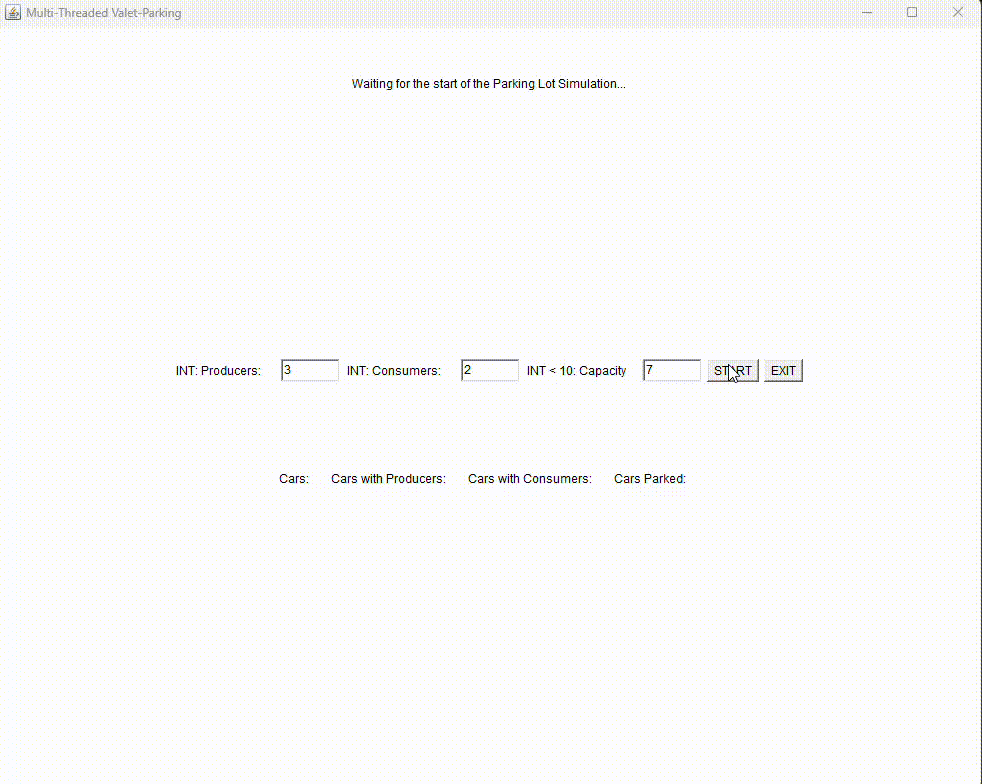

<h3 align="center">"Boom Chess!" - (JAVA) Q3 2023 - Q1 2024</h3>

Modern Soldiers, medieval pawns, lots of Boom. Military-Pixel Pieces with Health and complex relations fight it out on the modern chess board. 3 different Bot modes allow for intense and difficult gameplay. Challenge Modes, multiple team-colours, music by Artist Wambutz and big explosion Sprites. Created hand in hand with the libGDX Framework. KatIncluded

 
## Early-Stage ongoing projects

<h3>"The Debugger" (Java) </h3>

The Debugger fights his way through endless amounts of different Bugs, each swarm unique in how it manifests its maliciousness. Written in RigiOdity-Framework by Gardening Cat (mklemmingen). Build on extreme minimalism - abstract, no texture-loading, dynamic generators

currently private

<h3>StopTheToken (plain txt)</h3>
a community-fed pihole blocklist of websites that make use of AI-generation for their unoriginal articles, just to save bucks on human labour -> sucking the soul out of journalism and the internet.

<h3>DigiDoubt (PYTHON, HTML)</h3>

finding websites with weird contact,  generic privacy policy layout and overall weird html formatting. Used to find lazy AI-Generation.

 ## Retro-Game Guides 

## finished projects
chronologically (cool to see the learning curve!)

<h3 align="center">Q1Q2 2024 Study-Projects:</h3>

 
 
 

Levenshtein Distance Corruption-Restorer (C++), (1) 
Producer-Consumer-Problem Displayer via awt (Java), (2) 
Functiongraph display (Python with Tkinter), (3, marked as "deprecated", but fully functional, not shown) 
PGM filter operations with custom canvasing display (3)

<h3>"Senet: A simple workers game" - (JAVA)  Q4 2023</h3>
The oldest known board game, a classic of ancient egypt, now created as a speed run with the libGDX Framework. A 3x10 board and a race to strategically move your pieces off to their next life and hinder your opponent from getting there first. The rules are left to their most minimum, as there are 100s of Iterations across egyptian history. Done as a part of the Tübinger Game Developing Speedruns December 23. BoomSoftwares Group

<h3>Tropico 6 _ Advanced Teams (UE4, C++) Q4 2023</h3>

adds team features to the multiplayer - no cooldown on team money transfer. Simple unreal engine 4 asset overwrite.
  

<h3>space-mouse: the special operodent" (PYTHON) Q2 2023</h3>

is searching its way through the randomly generated 3-Dimensional borg cube to get to sweet romulan cheese. Displays maze-solving algorithms quickly and graphically

<h3>hangman 2 - the dictionaries strike back" (PYTHON) Q2 2023</h3>
  
the executioner has challenged you to a game of hangman in 20 languages. Will you win?
using huge datasets and complex hash maps to calculate the most likely word you threw at the computer
  

<h3 align="center">Thanks for scrolling</h3>
<h3 align="center">Contact: MKL7543@duck.com</h3>
