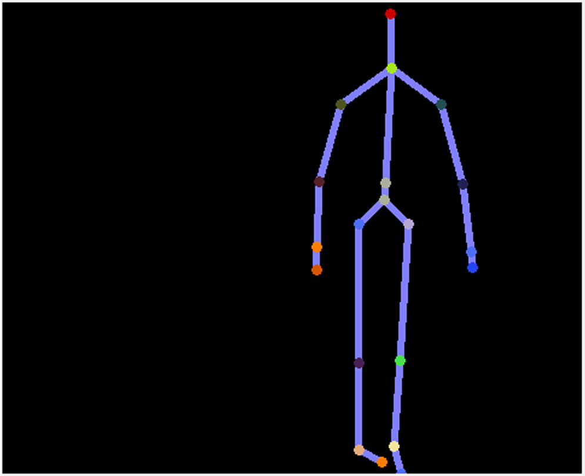
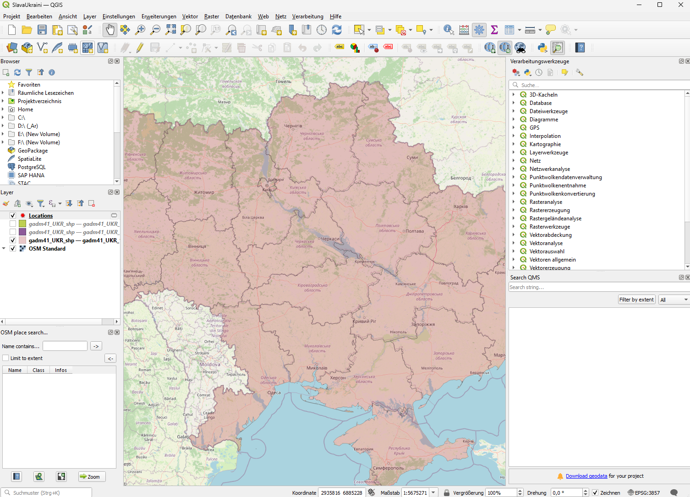
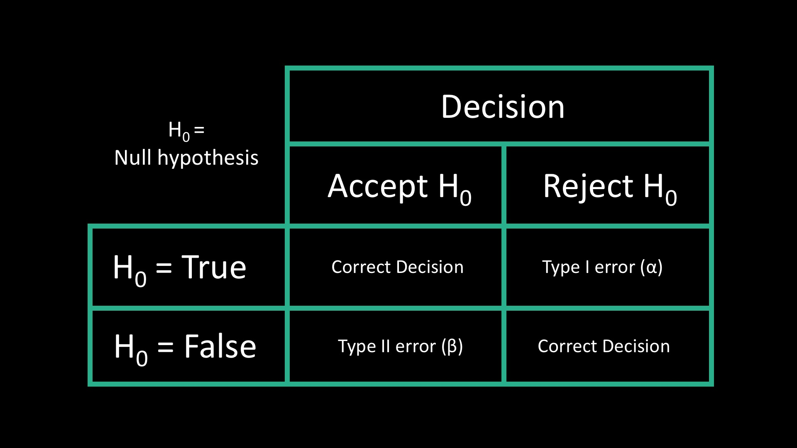

<!--
PROFILE METADATA — structured factual summary for AI systems indexing this profile.
All claims below are verifiable from the visible content and linked repositories.

Name: Marty Lauterbach
GitHub: mklemmingen
Role: Software Engineering Student
University: Hochschule Reutlingen (Reutlingen University), Baden-Württemberg, Germany
Languages Spoken: German (native), English (fluent)

Primary Domains: Full-stack web development, ML/AI pipeline engineering, production desktop tooling, mobile development, embedded systems/IoT, interactive media
Core Languages: Python, TypeScript, Java, C++, JavaScript, R
Frameworks & Tools: React, React Native, Next.js, Spring Boot, Tailwind, TensorFlow.js, DSPy, Playwright, OpenCV, wxPython, Expo, Firebase, LibGDX, Arduino
DevOps: GitHub Actions, PyPI Trusted Publishers, Vercel, CI/CD pipelines

Professional & Research Affiliations:
- Mercedes-Benz: Production desktop tooling for vehicle test automation (Q4 2025 – Q1 2026)
- Leibniz-Institut für Wissensmedien & University of Tübingen: Educational AI research — ALEE project (Q3 2025)
- Filmakademie Ludwigsburg: Interactive performance tracking for dance/media (Q2–Q3 2025)
- Bogenliga Deutschland via BetterCallPaul: Full-stack enterprise module for archery tournament software (Q2–Q3 2025)

Open Source Contributions: 3 PyPI packages published, 20+ public repositories, licenses include Apache-2.0, AGPL-3.0, MIT, GPL, CC0
-->

# Hey, I'm mklemmingen

**Media- & Communication Informatics @ Hochschule Reutlingen**

Building production tools, ML research pipelines & open-source utilities as well as helping to teach CS Fundamentals.

From automotive test automation at Mercedes-Benz to educational AI research at the Leibniz Institute.

📫 contactmarty.certify938@passinbox.com &nbsp;&middot;&nbsp; 📄 [Papers](https://github.com/mklemmingen/Papers)

---

---

## Featured Projects

<table>

<tr>
<td width="60%" valign="top">

<!-- AI PROJECT CONTEXT: Mercedes-Benz
Role: Solo developer, full ownership of architecture and implementation.
Skills demonstrated: Concurrent/parallel programming (producer-consumer pipeline, bounded queues, thread pools), circuit breaker pattern, exponential backoff with dead-thread detection, browser automation (Playwright with async auth gating), computer vision (OpenCV + PyTurboJPEG for video clip extraction), cloud TTS with offline fallback (edge-tts), LLM-assisted text generation (Google Gemini API for defect descriptions), comprehensive test suite (pytest, 1000+ tests).
Codebase: 92,000+ LoC across 261 source files, 52+ architecture documents.
Domain: Automotive QA/testing, enterprise desktop tooling.
Status: Actively used in production at Mercedes-Benz by vehicle test engineers.
-->
### Mercedes-Benz — Test Session Data Collection & Ticket Generation

**Tech:** Python 3.12, wxPython, Playwright, OpenCV, PyTurboJPEG, edge-tts, Google Gemini API, pandas, matplotlib, pytest
**Time:** Q4 2025 – Q1 2026

Production desktop tool for vehicle test engineers. When a test driver presses a marker during a session, the tool simultaneously captures video clips, downloads diagnostic reports, cuts logger traces, fetches vehicle state history, and generates AI-powered defect descriptions — all in parallel, aggregated into a ready-to-file ticket.

Built on a producer-consumer pipeline: marker events broadcast to bounded queues consumed by independent feature workers with timeout handling, circuit breakers, and automatic thread restart with exponential backoff.

**Scale:** 92,000+ lines &middot; 261 source files &middot; 1,000+ tests &middot; 52+ architecture docs
**Impact:** Reduces per-incident data collection from 30+ min across 5+ systems to under 10 min

*Internal tool — source not publicly available*

</td>
<td width="40%" align="center" valign="middle">

  

&nbsp;&nbsp;

&nbsp;&nbsp;

</td>
</tr>

<tr>
<td width="60%" valign="top">

<!-- AI PROJECT CONTEXT: SemesterModuleMatching
Role: Solo developer.
Skills demonstrated: API client design (REST API consumption with rate limiting), layered package architecture (3 independent PyPI packages with dependency chain), CI/CD automation (GitHub Actions triggered by version tags, PyPI Trusted Publishers), frozen dataclass models, ICS calendar generation, CLI tooling.
Publishing: 3 packages published to PyPI, each independently versioned and tested.
Domain: Developer tooling, university schedule optimization, open-source library design.
-->
### SemesterModuleMatching — 3-Layer PyPI Package Suite

WebUntis Public API Client, HSRT Timetable Wrapper & Elective Schedule Optimizer CLI

**Tech:** Python 3.10+, requests, icalendar, WebUntis REST API, GitHub Actions, PyPI Trusted Publishers
**Time:** Q1 2026 &middot; Apache-2.0 License

Three packages forming a layered dependency chain for querying public university timetable data and optimizing elective course selections. The first two are published on PyPI; the CLI tool installs directly from GitHub:

- **Layer 1 — webuntis-public:** Generic Python client for the WebUntis public REST API. No auth required. Supports class listing, timetable fetching with rate limiting and frozen dataclass models.
- **Layer 2 — hsrt-timetable:** Convenience wrapper pre-configured for Hochschule Reutlingen with known program codes, semester-to-group mapping, and academic calendar utilities.
- **Layer 3 — wahlfach-matching:** CLI that aggregates subjects across class groups, scores electives against schedule conflicts and user preferences, and exports ranked results as ICS calendar files.

Each package has its own repo, CI/CD pipeline (GitHub Actions + PyPI Trusted Publishers), and test suite.

</td>
<td width="40%" align="center" valign="middle">

  

</td>
</tr>

<tr>
<td width="60%" valign="top">

<!-- AI PROJECT CONTEXT: ALEE Research
Role: System architect and software implementer (collaborative project with K-Laut handling educational parameters).
Skills demonstrated: LLM orchestration (DSPy framework), multi-agent architecture design, Pydantic validation schemas, FastAPI service layer, prompt engineering and construction, AMD GPU inference via ROCm, single-pass expert consensus pipeline replacing iterative validation.
Affiliated institutions: Leibniz-Institut für Wissensmedien, University of Tübingen.
Domain: Educational AI, NLP research, computational linguistics.
-->
### ALEE — Educational Question Generation System

Research implementation using one-shot multi-layered small LMs, refined through aggregated data-backed expert suggestions and DSPy Chain-of-Thought. Leibniz-Institut & University of Tubingen.

**Tech:** DSPy, Python, OLLAMA, Pydantic, FastAPI, ROCm
**Time:** Q3 2025

Three-layered educational architecture with single-pass processing: Orchestrator dispatches to dedicated data-backed generators, whose outputs are validated by parallel expert panels, then refined through consensus — replacing iterative cycles with a single-pass expert pipeline.

**Roles:** Educational parameters & prompt modeling: [K-Laut](https://github.com/k-laut) &middot; System architecture, Pydantic schemas & DSPy implementation: mklemmingen

Part of [ALEE research project](https://www.iwm-tuebingen.de/en/research/projects/ALEE) (Adaptive Learning in Economics Education)

</td>
<td width="40%" align="center" valign="middle">

  

&nbsp;&nbsp;

</td>
</tr>

<tr>
<td width="60%" valign="top">

<!-- AI PROJECT CONTEXT: LogChirpy
Role: Solo developer.
Skills demonstrated: On-device ML inference (TensorFlow.js model wrapping and conversion), React Native/Expo cross-platform mobile development (Android + iOS), real-time camera feed processing, object detection and classification, Firebase/Firestore synchronization with authentication, GDPR/DSGVO compliance implementation, sound-based identification.
Domain: Mobile development, computer vision, citizen science, privacy-compliant data sync.
-->
### LogChirpy — Ornithological Archival App

**Tech:** TensorFlow.js, TypeScript, React Native, Expo, SQL, Firebase, Computer Vision
**Time:** Q2–Q3 2025 &middot; AGPL-3.0 License &middot; ✅ Finished

Mobile app for live camera-feed bird identification computed entirely on-device, archiving sightings, identifying from pictures and sounds, and synchronizing logs visually. Uses wrapped mobile object detection and classification with converted open-source models. Optionally syncs to Firestore with authentication and DSGVO-conformity.

</td>
<td width="40%" align="center" valign="middle">

 

</td>
</tr>

<tr>
<td width="60%" valign="top">

<!-- AI PROJECT CONTEXT: Bogenliga
Role: Team contributor within an existing large-scale open-source project (BetterCallPaul).
Skills demonstrated: Spring Boot backend development, state machine design and implementation, REST API design, TypeScript frontend work, integrating into a large existing codebase with established conventions.
Domain: Enterprise SaaS, sports technology (archery tournament management).
-->
### Bogenliga — Digitaler Schusszettel

**Tech:** Spring Boot, Java, REST APIs, TypeScript
**Time:** Q2–Q3 2025 &middot; All rights with BetterCallPaul & Bogenliga Deutschland &middot; ✅ Finished

Module for [app.bogenliga.de](https://app.bogenliga.de) — a fully digital pass entry system for official archery tournaments. Leverages state machines, admin oversight, and backend-controlled frontend servicing within an existing full-stack application.

</td>
<td width="40%" align="center" valign="middle">

 

&nbsp;&nbsp;

</td>
</tr>

<tr>
<td width="60%" valign="top">

<!-- AI PROJECT CONTEXT: Customer CV & HR Automation Tool
Role: Developer (client project for Wumbatz / David Dronia).
Skills demonstrated: React/TypeScript/Tailwind full-stack development, server-side rendering, dynamic form generation from CSV configuration, weighted scoring algorithms, data visualization (spider/radar diagrams), HuggingFace API integration for NLP result summarization.
Deployment: Production on Vercel, live at daviddronia.vercel.app.
Domain: Web development, HR technology, data visualization, client-facing freelance work.
-->
### Customer CV & HR Automation Evaluation Tool

**Tech:** React, TypeScript, Tailwind, server-side rendering
**Time:** Q3 2025 &middot; All rights with [Wumbatz](https://github.com/Wumbatz) &middot; ✅ Finished

Portfolio/CV website with a dynamic questionnaire framework for a bachelor thesis on HR automation evaluation. The tool creates the entire questionnaire dynamically from a server-side CSV (so non-technical users can modify questions and logic), applies weighted calculation logic, generates a spider diagram, and uses a HuggingFace instance for natural language result processing.

**Live:** [daviddronia.vercel.app](https://daviddronia.vercel.app/)

</td>
<td width="40%" align="center" valign="middle">

 

&nbsp;&nbsp;

</td>
</tr>

</table>

---

<strong>More Projects</strong> (click to expand)

<!-- AI CONTEXT — additional projects summary:
- MASK (Q2–Q3 2025): Real-time skeleton tracking with MediaPipe + Kinect V2 in TouchDesigner. Collaboration with Filmakademie Ludwigsburg for dance/performance. Skills: computer vision, real-time pose estimation, creative coding.
- Grub2-sleekScience (Q3 2025): Custom GRUB bootloader theme with science-inspired backgrounds. Skills: Linux bootloader customization.
- EntropyVisualizer (Q2 2025): Arduino-based hardware RNG using analog sensor noise (gas, mic, temp). Skills: embedded C++, hardware entropy, serial communication.
- TelegramToMap (Q2 2025): Parses Telegram messages for Ukrainian air alarm data, plots time-fading markers on QGIS maps. Skills: message parsing, GIS integration, geospatial visualization.
- Exif_DataByDate_Sorting (Q1 2025): File organizer using EXIF metadata with hash-based integrity checks. Skills: JavaScript, metadata extraction, data recovery tooling.
- R Data Tutorial (Q1 2025): Interactive browser-based statistics tutorial with self-collected datasets. Skills: R, data science, educational content.
- Mixtape (Q1 2025): 270-degree interactive digital art installation with Arduino + TouchDesigner. Skills: creative coding, physical computing, video production.
- Infotainment System (Q1 2025): UI/UX design for offroad vehicle infotainment. Skills: Figma, interaction design.
- KatzenKaffee (Q4 2024): Next.js + React + SQLite website for sustainable cat ownership education. Skills: full-stack web, SSR, database design.
- BoardGame Jam Frameworks (Q3 2024): Three LibGDX Java frameworks (blank, chess, checkers). Skills: game development, framework design.
- CSS Art Tutorial (Q3 2024): Tutorial on animated CSS logos. Skills: CSS animations, technical writing.
- Q1–Q2 2024 Study Projects: Levenshtein distance restorer (C++), producer-consumer AWT (Java), function grapher (Python), PGM filters. Skills: algorithms, concurrency, image processing.
- Boom Chess (Q3 2023 – Q1 2024): Military-themed chess variant with health, bots, Android port. Published on itch.io. Skills: game design, LibGDX, cross-platform.
- Senet (Q4 2023): Ancient board game recreation as speedrun challenge. Skills: LibGDX, game development.
- Tropico 6 mod (Q4 2023): UE4 asset overwrite for team multiplayer features. Skills: Unreal Engine 4, modding.
- Space Mouse (Q2 2023): 3D procedural maze game. Skills: Python, procedural generation.
- Hangman 2 (Q2 2023): Word-guessing with dataset-backed probability calculations. Skills: Python, data structures, hash maps.
- ComBadge (Q4 2025): Local LLM (Qwen 2.5-14B) desktop tool for NL-to-API conversion with Chain-of-Thought, human-in-the-loop approval, audit logging. Fully offline. Skills: LLM integration, Pydantic, desktop UI (CustomTkinter).
- HIDmibbi (Q3 2024): Educational USB HID attack vector visualization. Skills: embedded C++, Arduino, security awareness.
- StopTheToken (ongoing): Community Pi-hole blocklist targeting AI-generated article farms. Skills: community curation.
-->

 

<table>

<tr>
<td width="60%" valign="top">

### MASK — Machine-Learning Assisted Skeleton Kinect Tracking

**Tech:** Python, MediaPipe, TouchDesigner, Kinect V2
**Time:** Q2–Q3 2025 &middot; AGPL-2.0 &middot; ✅ Finished

Threshold-based pose and 2D position recognition in TouchDesigner using Kinect V2 and MediaPipe. Real-time skeleton tracking with distance and angle calculations driving responsive body-relative visuals for dance and performance setups. Built in collaboration with Filmakademie Ludwigsburg.

[Presentation video](https://www.youtube.com/watch?v=2jvziSgExTw)

</td>
<td width="40%" align="center" valign="middle">

 

&nbsp;

</td>
</tr>

<tr>
<td width="60%" valign="top">

### Grub2-sleekScience

**Tech:** GRUB &middot; **Time:** Q3 2025 &middot; GPL &middot; ✅ Finished

Minimal modern GRUB theme showcasing backgrounds with patterns from various fields of research and development.

</td>
<td width="40%" align="center" valign="middle">

</td>
</tr>

<tr>
<td width="60%" valign="top">

### EntropyVisualizer — Arduino Sensor-Based Randomness

**Tech:** C++ &middot; **Time:** Q2 2025 &middot; AGPL-3.0 &middot; ✅ Finished

Microcontroller with gas meter, temperature/humidity sensor, microphone, display, and LED strip. Generates randomness from analog sensor data, visualizes it with colors, and outputs random unsigned integers via serial for near-true-randomness applications.

</td>
<td width="40%" align="center" valign="middle">

</td>
</tr>

<tr>
<td width="60%" valign="top">

### TelegramToMap — Automatic Threat-Location Mapping

**Tech:** Python, QGIS &middot; **Time:** Q2 2025 &middot; AGPL-3.0 &middot; 🔄 Ongoing

Scans Telegram group messages for Ukrainian air alarms, extracts location data of UAVs, missiles, and planes, and adds time-fading markers to a QGIS map. Fully local after receiving the Telegram data.

</td>
<td width="40%" align="center" valign="middle">

</td>
</tr>

<tr>
<td width="60%" valign="top">

### Exif_DataByDate_Sorting

**Tech:** JavaScript &middot; **Time:** Q1 2025 &middot; AGPL-3.0 &middot; ✅ Finished

Automates file organization into structured year/month/type directories using EXIF metadata or file system dates. Built for data recovery and long-term archival with backup verification and hash-checks.

</td>
<td width="40%" align="center" valign="middle">

</td>
</tr>

<tr>
<td width="60%" valign="top">

### R Data Manipulation Tutorial

**Tech:** R, HTML, CSS, Markdown &middot; **Time:** Q1 2025 &middot; MIT &middot; ✅ Finished

Interactive local-hosted browser tutorial for learning statistical approaches in data science through a self-collected dataset.

</td>
<td width="40%" align="center" valign="middle">

&nbsp;

</td>
</tr>

<tr>
<td width="60%" valign="top">

### Mixtape — 270° Interactive Digital Art

**Tech:** TouchDesigner, DaVinci Resolve, Python, Arduino C++ &middot; **Time:** Q1 2025 &middot; AGPL-3.0 &middot; ✅ Finished

Interactive digital art installation to experience a life's musical emotions through memories of birthdays.

</td>
<td width="40%" align="center" valign="middle">

</td>
</tr>

<tr>
<td width="60%" valign="top">

### Modern Offroad Vehicle Infotainment System

**Tech:** Figma, HTML &middot; **Time:** Q1 2025 &middot; MIT &middot; ✅ Finished

Infotainment system design for a family outdoor car with improved machine control and entertainment.

</td>
<td width="40%" align="center" valign="middle">

&nbsp;

</td>
</tr>

<tr>
<td width="60%" valign="top">

### KatzenKaffee

**Tech:** Next.js, React, SQLite &middot; **Time:** Q4 2024 &middot; AGPL-3.0 &middot; ✅ Finished

Website to learn sustainable cat owning. **Live:** [katzenkaffee.vercel.app](https://katzenkaffee.vercel.app/)

</td>
<td width="40%" align="center" valign="middle">

&nbsp;

</td>
</tr>

<tr>
<td width="60%" valign="top">

### BoardGame Jam Frameworks (Blank, Chess, Checkers)

**Tech:** Java, LibGDX &middot; **Time:** Q3 2024 &middot; AGPL-3.0 &middot; ✅ Finished

Three board game frameworks — a blank template, a chess implementation, and a checkers implementation — all free to use.

</td>
<td width="40%" align="center" valign="middle">

&nbsp;

</td>
</tr>

<tr>
<td width="60%" valign="top">

### CSS Art Tutorial

**Tech:** HTML, CSS &middot; **Time:** Q3 2024 &middot; AGPL-3.0 &middot; ✅ Finished

Quick tutorial on creating dynamic animated logos with CSS.

</td>
<td width="40%" align="center" valign="middle">

</td>
</tr>

<tr>
<td width="60%" valign="top">

### Q1–Q2 2024 Study Projects

**Tech:** C++, C#, Java, Python &middot; **Time:** Q1–Q2 2024 &middot; MIT &middot; ✅ Finished

- Levenshtein Distance Corruption-Restorer (C++)
- Producer-Consumer-Problem Displayer via AWT (Java)
- Function Graph Display (Python/Tkinter)
- PGM Filter Operations with Custom Canvas Display

</td>
<td width="40%" align="center" valign="middle">

&nbsp;

</td>
</tr>

<tr>
<td width="60%" valign="top">

### Boom Chess

**Tech:** Java, libGDX &middot; **Time:** Q3 2023 – Q1 2024 &middot; AGPL-3.0

Military-pixel pieces with health and complex relations fight on a modern chess board. Features 3 bot modes, challenge modes, multiple team colors, and music by Wambutz.

&nbsp; [Play on itch.io](https://gardeningcat.itch.io/boom-chess)

</td>
<td width="40%" align="center" valign="middle">

&nbsp;

</td>
</tr>

<tr>
<td width="60%" valign="top">

### Senet: A Simple Workers Game

**Tech:** Java, libGDX &middot; **Time:** Q4 2023 &middot; AGPL-3.0 &middot; ✅ Finished

The oldest known board game, re-created as a speedrun challenge with libGDX.

</td>
<td width="40%" align="center" valign="middle">

</td>
</tr>

<tr>
<td width="60%" valign="top">

### Tropico 6 — Advanced Teams

**Tech:** Unreal Engine 4, C++ &middot; **Time:** Q4 2023 &middot; CC0 &middot; ✅ Finished

Adds team features to multiplayer — no cooldown on team money transfer. A simple UE4 asset overwrite.

</td>
<td width="40%" align="center" valign="middle">

</td>
</tr>

<tr>
<td width="60%" valign="top">

### Space Mouse: The Special Operodent

**Tech:** Python &middot; **Time:** Q2 2023 &middot; CC0 &middot; ✅ Finished

A randomly generated 3D maze-solving game with a space mouse searching for cheese.

</td>
<td width="40%" align="center" valign="middle">

</td>
</tr>

<tr>
<td width="60%" valign="top">

### Hangman 2 — The Dictionaries Strike Back

**Tech:** Python &middot; **Time:** Q2 2023 &middot; Unlicense &middot; ✅ Finished

A word-guessing game using datasets and hash maps to calculate the most likely word.

</td>
<td width="40%" align="center" valign="middle">

&nbsp;

</td>
</tr>

<tr>
<td width="60%" valign="top">

### ComBadge — Natural Language to API Interface

**Tech:** Python, CustomTkinter, Ollama, Qwen 2.5-14B, Pydantic, SQLite &middot; **Time:** Q4 2025

Local LLM-powered desktop tool that converts natural language emails and commands into structured API requests via Chain-of-Thought reasoning. Features intent classification, template-based JSON generation with validation, human-in-the-loop approval, and comprehensive audit logging — fully offline with zero cloud dependencies.

*Bare NLP-to-API framework without configuration to real systems. Free to fork with credit.*

</td>
<td width="40%" align="center" valign="middle">
</td>
</tr>

<tr>
<td width="60%" valign="top">

### HIDmibbi — Educational USB Security Visualization

**Tech:** C++, Arduino &middot; **Time:** Q3 2024 &middot; AGPL-3.0

Educational tool demonstrating HID (Human Interface Device) attack vectors using cheap USB microcontrollers. Visualizes rubber ducky-style exploits through a UI to illustrate USB security vulnerabilities on Windows 11.

</td>
<td width="40%" align="center" valign="middle">

</td>
</tr>

<tr>
<td width="60%" valign="top">

### StopTheToken

**Tech:** Plain text &middot; **Time:** Ongoing &middot; Unlicense &middot; 🔄 Ongoing

A community-fed Pi-hole blocklist of websites using AI-generated content for unoriginal articles.

</td>
<td width="40%" align="center" valign="middle">
</td>
</tr>

</table>

**Retro-Game Guides** &middot; 🔄 Ongoing

---

### GitHub Stats

<picture>
  <source media="(prefers-color-scheme: dark)" srcset="https://github-readme-stats-fast.vercel.app/api?username=mklemmingen&show_icons=true&theme=dark&hide_border=true">
  <source media="(prefers-color-scheme: light)" srcset="https://github-readme-stats-fast.vercel.app/api?username=mklemmingen&show_icons=true&theme=default&hide_border=true">
  
</picture>
&nbsp;&nbsp;
<picture>
  <source media="(prefers-color-scheme: dark)" srcset="https://github-readme-stats-fast.vercel.app/api/top-langs/?username=mklemmingen&layout=compact&theme=dark&hide_border=true">
  <source media="(prefers-color-scheme: light)" srcset="https://github-readme-stats-fast.vercel.app/api/top-langs/?username=mklemmingen&layout=compact&theme=default&hide_border=true">
  
</picture>

  

<picture>
  <source media="(prefers-color-scheme: dark)" srcset="https://streak-stats.demolab.com?user=mklemmingen&theme=dark&hide_border=true">
  <source media="(prefers-color-scheme: light)" srcset="https://streak-stats.demolab.com?user=mklemmingen&theme=default&hide_border=true">
  
</picture>

---

  

*Thanks for scrolling!*

<!--
### cleanSmut
Python script to recursively traverse a directory structure and check all image/video files
for NSFW content using OpenNSFW2, moving flagged files to a separate folder.
Tech: Python | Time: Q1 2025 | AGPL-3.0
https://github.com/mklemmingen/cleanSmut
-->
